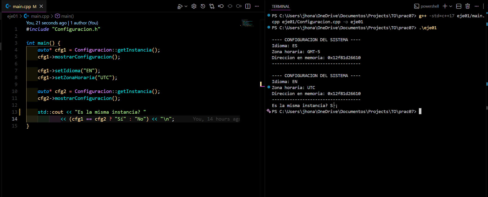

<h2 align="center">
  Ejercicio 01 (Básico): Implementación directa del patrón Singleton
  

    
    
  

</h2>

<h3>Explicación breve del código</h3>

  Este ejercicio implementa un <b>patrón Singleton</b> en <b>C++</b> mediante la clase 
  <code>Configuracion</code>, encargada de almacenar las configuraciones generales del sistema,
  como el idioma y la zona horaria. El patrón garantiza que <b>solo exista una única instancia</b>
  durante toda la ejecución del programa, sin importar cuántas veces se solicite.

<ul>
  <li><b>static Configuracion* instancia:</b> almacena la única instancia global del sistema.</li>
  <li><b>getInstancia():</b> crea la instancia si no existe y devuelve siempre la misma referencia.</li>
  <li><b>mostrarConfiguracion():</b> imprime el idioma, zona horaria y dirección en memoria.</li>
  <li><b>setIdioma():</b> valida el idioma antes de asignarlo (solo ES, EN, PT, FR).</li>
  <li><b>reset():</b> método auxiliar para pruebas que elimina la instancia (no usado normalmente).</li>
</ul>

  El ejercicio demuestra cómo centralizar configuraciones globales del sistema en un único objeto. 
  Incluso si se llaman varias veces a <code>getInstancia()</code>, todas las variables apuntan 
  al mismo objeto en memoria.

<h3>Resultado</h3>

  Al ejecutar el programa se observa:

<ul>
  <li>La configuración inicial (ES, GMT-5).</li>
  <li>La configuración modificada (EN, UTC).</li>
  <li>La misma dirección en memoria mostrada por ambas llamadas.</li>
  <li>El mensaje final: <b>"¿Es la misma instancia? Sí"</b>.</li>
</ul>

<h1 align="center">
   
  
   
</h1>