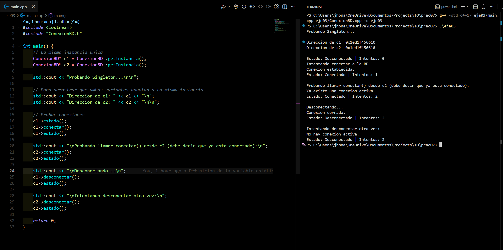

<h2 align="center">
  Ejercicio 03 (Aplicado): Simulación de conexión a una base de datos usando Singleton
  

    
    
  

</h2>

<h3>Descripción del ejercicio</h3>

  Este programa implementa una clase <code>ConexionBD</code> que simula de forma sencilla la conexión a una base de
  datos. Se utiliza el patrón <b>Singleton</b> para garantizar que <b>solo exista una única conexión activa</b>
  durante toda la ejecución del programa.

  La instancia es accesible mediante el método <code>getInstancia()</code>, que siempre devuelve la misma dirección de
  memoria, incluso si diferentes partes del programa intentan crear nuevas conexiones.

<h3>Características principales</h3>
<ul>
  <li><b>static ConexionBD* instancia:</b> almacena la única instancia permitida.</li>
  <li><b>getInstancia():</b> crea la instancia al inicio y luego siempre la reutiliza.</li>
  <li><b>conectar():</b> simula un intento de conexión y evita reconectar si ya está activa.</li>
  <li><b>desconectar():</b> cierra la conexión si está activa.</li>
  <li><b>estado():</b> muestra si está conectado y cuántos intentos se hicieron.</li>
  <li><b>intentos:</b> contador simple que permite ver cuántas veces se llamó a <code>conectar()</code>.</li>
</ul>

<h3>Explicación del comportamiento</h3>

  En el <code>main</code>, se crean dos punteros (<code>c1</code> y <code>c2</code>) llamando a <code>getInstancia()</code>.
  Ambos apuntan a la <b>misma dirección de memoria</b>, lo que demuestra que la conexión es única. Luego se llama a
  <code>conectar()</code>, <code>estado()</code> y <code>desconectar()</code> desde ambos punteros, mostrando que todos
  operan sobre la misma instancia global.

<h3>Resultado esperado</h3>

El programa debe mostrar:

<ul>
  <li>Que <code>c1</code> y <code>c2</code> tienen la misma dirección (prueba del Singleton).</li>
  <li>Que solo se puede establecer una conexión activa.</li>
  <li>Que los métodos llamados desde <code>c1</code> y <code>c2</code> afectan al mismo objeto.</li>
  <li>Mensajes informativos según el estado: conectado, desconectado o ya conectado.</li>
</ul>

<h1 align="center">
   
  
   
</h1>

  Con esto se verifica el funcionamiento del patrón Singleton en un contexto práctico de simulación de conexión a base
  de datos.

