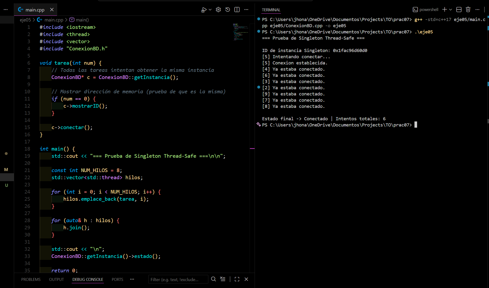

<h2 align="center">
  Ejercicio 05 (Desafío): Singleton seguro en entornos multihilo
  

    
    
  

</h2>

<h3>Descripción del ejercicio</h3>

  Este programa implementa una versión mejorada del patrón <b>Singleton</b> usando mecanismos de sincronización para hacerlo <b>seguro en entornos multihilo</b>. 
  La clase <code>ConexionBD</code> simula una conexión a una base de datos y garantiza que 
  <b>solo una única instancia</b> pueda existir, incluso cuando varios hilos intentan crearla simultáneamente.

<h3>¿Qué lo hace diferente?</h3>

  A diferencia de un Singleton tradicional, esta versión utiliza <b>double-checked locking</b> junto con un 
  <code>std::mutex</code> para evitar condiciones de carrera. También incluye un mutex adicional para mantener ordenada 
  la salida en consola cuando múltiples hilos imprimen información al mismo tiempo.

<ul>
  <li><b>static ConexionBD* instancia:</b> almacena la única instancia global.</li>
  <li><b>static std::mutex mtx:</b> protege la creación de la instancia.</li>
  <li><b>getInstancia():</b> aplica <i>double-checked locking</i> para asegurar thread-safety.</li>
  <li><b>conectar():</b> simula el intento de conexión usando el mismo objeto desde varios hilos.</li>
  <li><b>mostrarID():</b> muestra la dirección de la instancia (útil para la prueba multihilo).</li>
</ul>

<h3>Comportamiento del programa</h3>

  El <code>main</code> lanza varios hilos simultáneamente. Cada uno intenta obtener la instancia del Singleton y llamar a 
  <code>conectar()</code>. Como resultado:

<ul>
  <li>Se crea <b>una sola instancia</b> sin importar cuántos hilos compitan.</li>
  <li>Solo un hilo establece la conexión; los demás detectan que ya existe.</li>
  <li>La salida por consola se sincroniza gracias al mutex adicional.</li>
  <li>El número de intentos coincide con la cantidad de hilos ejecutados.</li>
</ul>

<h3>Resultado esperado</h3>
<h1 align="center">
   
  
   
</h1>

  Se observa que todos los hilos comparten la misma dirección de instancia y solo uno establece la conexión, 
  demostrando que el Singleton thread-safe funciona correctamente.

